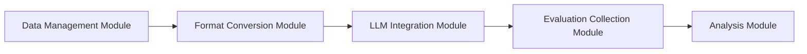
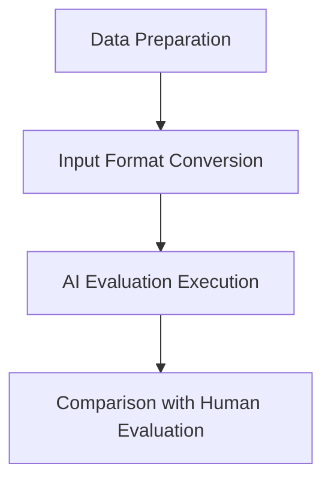

# PRISMA-AI

> Automating PRISMA guideline compliance assessments with large language models.  
> PRISMA（Preferred Reporting Items for Systematic Reviews and Meta-Analyses）ガイドライン遵守評価を大規模言語モデルで自動化する研究プロジェクトです。

## Overview

PRISMA-AI is a reproducible research platform that evaluates systematic reviews against the PRISMA checklist using multiple large language models (LLMs) and document formats. The project includes a modular evaluation pipeline, curated Creative Commons datasets, and experiment harnesses for format alignment, ensemble strategies, and evaluator benchmarking.

### 概要
PRISMA-AI は、システマティックレビュー論文に対する PRISMA チェックリスト適合性評価を LLM で支援するための研究基盤です。モジュール化された評価パイプライン、Creative Commons ライセンス付きデータセット、およびフォーマット比較やアンサンブル評価のための実験スクリプトを提供します。

## Highlights
- **Multi-format evaluation**: Markdown / JSON / XML / plaintext (`none`) checklists with per-format performance metrics.
- **Model-agnostic pipeline**: OpenAI, OpenRouter, Gemini Direct, Qwen, Grok, and custom evaluators via a shared `BaseEvaluator` interface.
- **Creative Commons datasets**: Enriched metadata (`creative_commons_license`, `cc_allows_commercial_use`, `cc_allows_derivatives`, `cc_requires_share_alike`) enables compliant redistribution.
- **Experiment playbooks**: Reusable scripts for multi-model scaling, ensemble overrides, and evaluator schema alignment.
- **Structured outputs**: Pydantic-validated schemas, detailed token usage, and processing-time telemetry for each run.

## Architecture




## Data & Licensing
- Public artifacts live in `supplement/data/`, covering Suda2025 (emergency medicine) and Tsuge2025 (rehabilitation) corpora. Each record bundles LLM-ready sections plus human annotations.
- Creative Commons attribution is enforced through `/legacy/analysis_scripts/filter_cc_license.py` and `/legacy/analysis_scripts/apply_cc_license_to_annotations.py`, which regenerate enriched JSON into `results/license_filter/enriched/`.
- `cc-by` variants are prioritized; comparative analysis for `cc-by-nc(-nd)` items is supported via metadata flags.
- Downstream consumers must retain the included license metadata and cite the original sources listed in the per-paper `metadata` section.

## Quick Start
```bash
python -m venv .venv
. .venv/bin/activate
pip install --upgrade pip
pip install -r requirements.txt

# Optional: export any API keys before running evaluations
export OPENROUTER_API_KEY=...
export PRISMA_AI_DRIVE_PATH="$PWD/data"
```

## Running Evaluations
```bash
# Validate configuration and dataset availability
python -m prisma_evaluator.cli.main validate-config
python -m prisma_evaluator.cli.main validate-data

# Minimal smoke test across two Suda2025 papers
python -m prisma_evaluator.cli.main run \
  --model openai/gpt-4o \
  --dataset suda \
  --paper-ids Suda2025_01,Suda2025_02 \
  --schema-type simple \
  --output-path results/sample_run.json

# Disable section-mode for checklist experiments
PRISMA_EVALUATOR_MAX_WORKERS=1 \
python -m prisma_evaluator.cli.main run \
  --dataset suda \
  --format markdown \
  --section-mode off

# Enable BO∞ sampling only when needed
python -m prisma_evaluator.cli.main run --bo-mode adaptive ...
```

## Experiment Workflows
- **Format scaling (2025-09-27)**: `test/issues/2025-09-27_suda_multi_format_scaling/` with `scripts/update_multi_model_format_table.py` producing per-paper processing-time statistics.
- **Checklist format re-evaluation (Suda CC-BY)**: Serialise evaluator calls (`PRISMA_EVALUATOR_MAX_WORKERS=1`) to avoid API rate limits.
- **Ensemble overrides (2025-09-28)**: `test/issues/2025-09-28_md_gpt4o_gpt5_ensemble/` summarises Markdown-driven TRUE override strategies.
- **API schema alignment tests**: `test/issues/2025-09-25_api_response_schema_alignment/scripts/test_single_paper_eval.py` validates Function Calling outputs; `run_openrouter_models.sh` batches OpenRouter evaluators.
- After checklist-format experiments, refresh summary tables via  
  ```bash
  PYTHONPATH=. venv/bin/python \
    test/issues/2025-09-27_gpt_oss_single_paper_formats/scripts/update_format_table.py
  ```

## Repository Layout
```
analysis/                        Reproducible aggregation notebooks and scripts
annotation_data_processing/      Legacy merge utilities for structured datasets
prisma_evaluator/                Core Typer CLI, pipeline, LLM connectors, metrics
protocol/                        Study protocol, manuscript drafts, citation assets
supplement/                      Public datasets and helper scripts (Creative Commons)
test/issues/YYYY-MM-DD_*         Issue-tracking experiments with code + reports
```

## Testing & Validation
- Targeted tests reside under `test/issues/` following `YYYY-MM-DD_issue_name` conventions with paired reports and JSON outputs.
- Use the provided virtual environment (`venv/`) to keep dependencies isolated.
- Large experiments should configure sensible timeouts and clean temporary files to preserve reproducibility.

## Roadmap
1. Expand evaluator coverage to additional open-source models and fine-tuned baselines.
2. Refine section-splitting and prompt templates for domain-specific PRISMA items.
3. Publish multi-format benchmarking results and ensemble findings in the accompanying manuscript.
4. Release a dataset card summarising licensing, provenance, and evaluation metrics.

## Contributing
- Follow the modular architecture in `prisma_evaluator/`; extend LLM providers by implementing `llm/base_evaluator.py`.
- Keep new datasets within Creative Commons-compatible terms and update license metadata scripts accordingly.
- Document new experiments under `test/issues/` and provide both Markdown and JSON outputs for reproducibility.
- Never commit secrets; configuration overrides live in `.env` (do not edit the tracked template).

## Citation
If you build on PRISMA-AI, cite the protocol in `protocol/protocol-english.md` and reference entries from `protocol/ref.bib`. A formal citation string will be published alongside the manuscript.

## Acknowledgements
- Suda2025 and Tsuge2025 research teams for sharing PRISMA annotations under Creative Commons.
- Contributors who refactored the evaluation pipeline into a Pydantic-first, CLI-driven architecture.
- Open-source communities (Typer, Pydantic, OpenRouter) powering the tooling stack.

---

For questions or collaboration requests, please open an issue or contact the maintainers listed in `AGENTS.md`.
